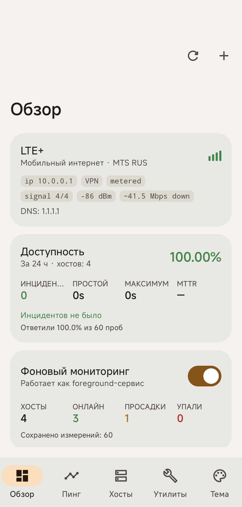
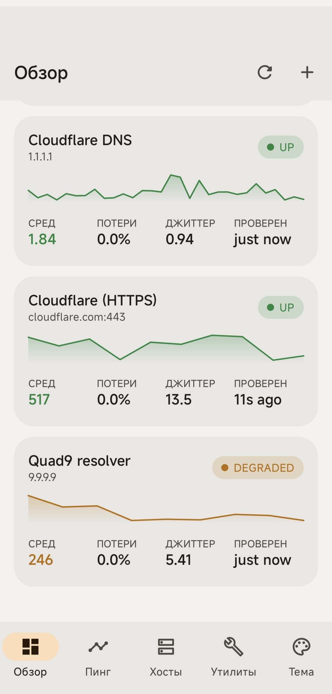
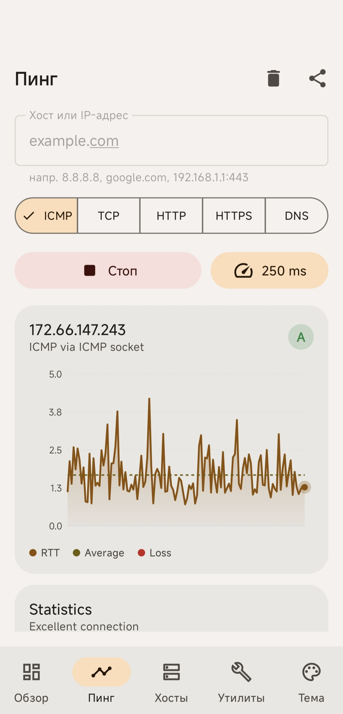
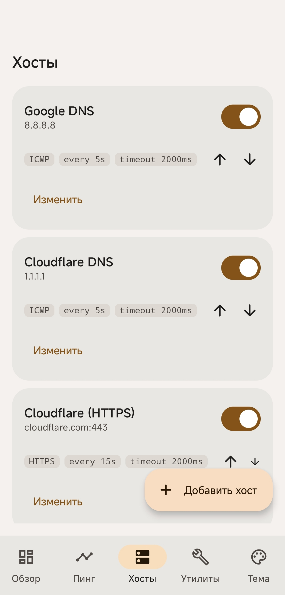
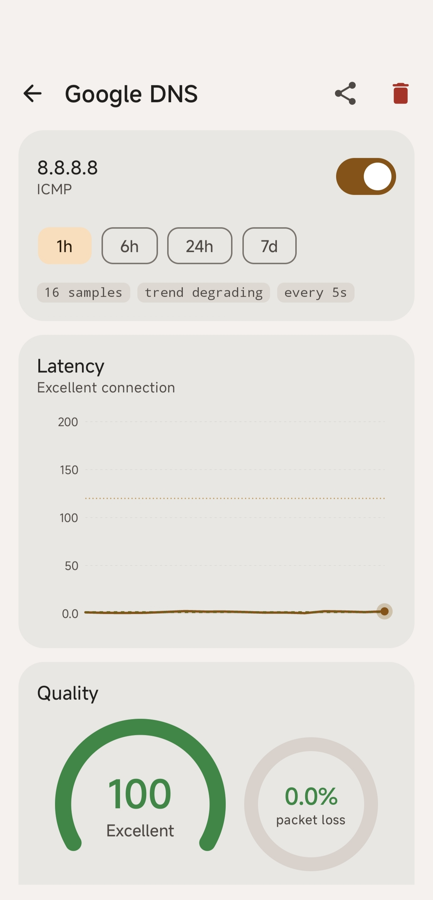
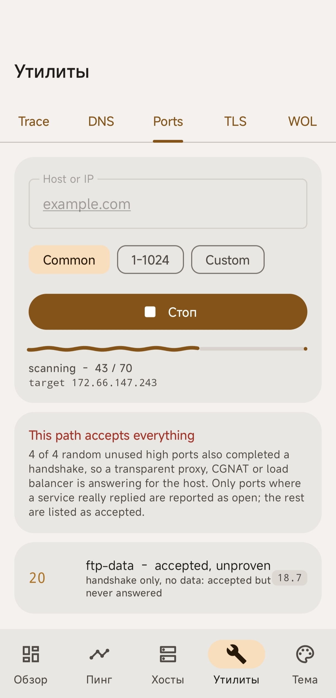
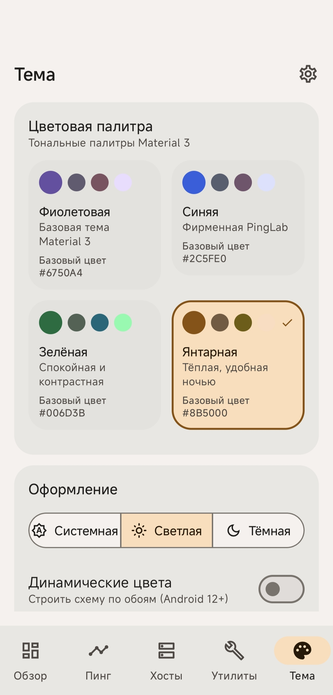

<h1 align="center">PingLab</h1>

<p align="center">
  Мониторинг доступности хостов на Android: ICMP/TCP/HTTP/DNS-пробы, живые графики задержки,
  фоновая слежка с уведомлениями и набор сетевых инструментов. Полностью на Kotlin и Jetpack Compose,
  дизайн — Material 3.
</p>

<p align="center">
  
  
  
  
  
  
  
</p>

<p align="center">
  <a href="https://github.com/n1kro-yeah/PingLab/actions/workflows/android.yml">
    
  </a>
  <a href="https://github.com/n1kro-yeah/PingLab/releases/latest">
    
  </a>
  <a href="https://github.com/n1kro-yeah/PingLab/releases">
    
  </a>
</p>

---

## Скриншоты

Сборка 1.1 на Xiaomi 14T — светлая тема, янтарная палитра. По порядку: Обзор, плитки хостов, живой пинг, список хостов, карточка хоста, утилиты, тема. Тап по картинке открывает её в полном размере.

<p align="center">
  <a href="docs/screenshots/01-dashboard.jpg"></a>
  <a href="docs/screenshots/02-dashboard-hosts.jpg"></a>
  <a href="docs/screenshots/03-live.jpg"></a>
  <a href="docs/screenshots/04-hosts.jpg"></a>
  <a href="docs/screenshots/05-host-detail.jpg"></a>
  <a href="docs/screenshots/06-tools.jpg"></a>
  <a href="docs/screenshots/07-theme.jpg"></a>
</p>

---

## Установка

Готовые сборки — в разделе [Releases](https://github.com/n1kro-yeah/PingLab/releases):

| Файл | Пакет | Для чего |
| --- | --- | --- |
| `pinglab-1.1-release.apk` | `live.nikro.pinglab` | обычная установка: minify + shrink, baseline profile, плавные 120 Гц |
| `pinglab-1.1-debug.apk` | `live.nikro.pinglab.debug` | отладочная сборка, ставится рядом с релизной и не конфликтует с ней |

После установки стоит выдать разрешение на уведомления — без него не будет ни постоянного уведомления сервиса, ни алертов о падении хоста.

> Обе сборки пока подписаны отладочным ключом, поэтому обновление «поверх» из Play в будущем потребует переустановки.

---

## Что умеет

| Экран | Возможности |
| --- | --- |
| **Обзор** | Карточка активной сети: Wi-Fi (диапазон, скорость линка, RSSI) и мобильный интернет (LTE / LTE+ / LTE Pro / 5G, оператор, шкала сигнала, dBm, роуминг). Карточка доступности за 24 часа: аптайм, число инцидентов, суммарный простой, самый долгий простой, MTTR. Переключатель фонового мониторинга и плитки со статусами хостов. |
| **Пинг** | Живая сессия: график задержки, скользящее среднее, консольный лог как у `ping`, статистика min/avg/max, джиттер, потери, MOS. |
| **Хосты** | CRUD хостов: протокол (ICMP/TCP/HTTP/HTTPS/DNS), порт, интервал, таймаут, пороги «просадки», вкл/выкл, сортировка. История и графики по каждому хосту. |
| **Утилиты** | Traceroute, DNS-резолв, сканер портов с доказательствами (open/closed/filtered), инспектор TLS-сертификата, Wake-on-LAN. |
| **Тема** | Material 3: фиолетовая палитра по умолчанию, светлая/тёмная/системная, динамические цвета (Android 12+), AMOLED-чёрный, витрина иконок и волнистых индикаторов загрузки. |
| **Настройки** | Автозапуск мониторинга, звук алертов, хранение истории (ретенция), экспорт CSV/JSON, «не гасить экран». |

Ещё:

- **Фоновый сервис** с постоянным уведомлением и кнопкой «стоп», отдельные каналы для тихого мониторинга и громких алертов.
- **Алерты** о падении, восстановлении и деградации — по одному слоту на хост, без спама при «мигании».
- **Плитка в шторке** (Quick Settings): включить/выключить мониторинг, не открывая приложение.
- **Диплинк** вида `pinglab:` + `//host/8.8.8.8` открывает живой пинг сразу по адресу.

---

## Стек

**Приложение**

| Что | Значение |
| --- | --- |
| Пакет (`applicationId`) | `live.nikro.pinglab` |
| Пакет debug-сборки | `live.nikro.pinglab.debug` |
| Версия | **1.1** (`versionCode 2`) |
| Минимальная ОС | Android 8.0, API 26 |
| Целевая ОС | Android 15, API 35 |
| Размер release-APK | ~1,8 МБ |
| Языки интерфейса | русский, английский |

**Ядро**

| Что | Чем | Версия |
| --- | --- | --- |
| Язык | Kotlin | 2.0.21 |
| Асинхронность | Coroutines + Flow | 1.9.0 |
| Сериализация | kotlinx.serialization | 1.7.3 |
| Минимальная/целевая ОС | Android | API 26 / 35 |
| JVM | Java toolchain | 17 |

**UI**

| Что | Чем | Версия |
| --- | --- | --- |
| UI-фреймворк | Jetpack Compose (BOM) | 2024.12.01 |
| Дизайн-система | Material 3 | 1.3.1 |
| Навигация | Navigation Compose | 2.8.5 |
| Адаптивность | material3-window-size-class | BOM |
| Иконки | material-icons-extended | BOM |
| Сплэш | core-splashscreen | 1.0.1 |
| Графики | собственные `Canvas`-компоненты | — |

**Данные и фон**

| Что | Чем | Версия |
| --- | --- | --- |
| БД | Room (+ KSP) | 2.6.1 |
| Настройки | DataStore Preferences | 1.1.1 |
| Отложенные задачи | WorkManager | 2.10.0 |
| Жизненный цикл | Lifecycle / ViewModel | 2.8.7 |
| Прогрев кода | ProfileInstaller + Baseline Profile | 1.4.1 |
| DI | ручной `ServiceLocator` | — |

**Сборка и качество**

| Что | Чем | Версия |
| --- | --- | --- |
| Сборка | Android Gradle Plugin | 8.7.3 |
| Кодогенерация | KSP | 2.0.21-1.0.28 |
| Тесты | JUnit4 | 4.13.2 |
| Инструментальные тесты | AndroidX Test + Espresso | 1.2.1 / 3.6.1 |
| Статический анализ | Android Lint (`checkDependencies = true`) | AGP |
| CI | GitHub Actions (unit-тесты, debug- и release-APK) | — |

---

## Архитектура

```
app/src/main/java/live/nikro/pinglab/
├─ core/
│  ├─ model/      # ProbeResult, LatencyStats, MonitoredHost, NetworkStatus, NetworkDetails…
│  ├─ net/        # ICMP-сокет, системный ping, TCP/HTTP/DNS-пробы, traceroute
│  └─ util/       # Formatters, HostValidator, NetworkInspector
├─ data/
│  ├─ db/         # Room: entities, DAO, база
│  ├─ prefs/      # DataStore-настройки
│  └─ repo/       # HostRepository, SampleRepository, SettingsRepository
├─ domain/
│  ├─ monitor/    # MonitorEngine: расписание проб, состояния хостов, алерты
│  └─ stats/      # LatencyStatistics, UptimeAnalyzer, качество связи
├─ service/       # PingMonitorService (FGS), NotificationCenter, ресивер, QS-плитка
├─ ui/
│  ├─ components/ # SectionCard, StatTile, графики, индикаторы загрузки
│  ├─ navigation/ # NavHost + нижняя навигация
│  ├─ screens/    # dashboard, live, hosts, tools, theme, settings
│  └─ theme/      # палитры Material 3, тональные схемы, статус-цвета
└─ di/            # ServiceLocator
```

Поток данных однонаправленный: `PingEngine → MonitorEngine → Repository (Room) → ViewModel (StateFlow) → Compose`.
Живые снимки от сервиса перекрывают историю из БД, пока сервис работает.

---

## Метрики

| Метрика | Как считается |
| --- | --- |
| Джиттер | RFC 3550: `J += (|D(i-1,i)| - J) / 16` |
| Перцентили | p50 / p90 / p95 / p99 по отсортированным RTT |
| R-фактор | `R = 93.2 - effLatency/40`, где `effLatency = avg/2 + jitter*2 + 10`; штраф `-2.5` за каждый % потерь |
| MOS | `1 + 0.035R + R(R-60)(100-R)·7.10e-6`, обрезка 1.0…4.41 |
| Качество | взвешенно: потери 45%, задержка 30%, джиттер 25% |
| Аптайм | по времени, а не по пакетам: инцидент = ≥2 неудачных пробы подряд, простой = от первой неудачи до восстановления |
| MTTR | среднее время закрытых инцидентов в окне |

Проблемы самого телефона (нет сети, отозвано разрешение) в аптайм не засчитываются — иначе метро в час пик выглядело бы как падение сервера.

---

## Сканер портов

Обычный `connect()` врёт: на многих сетях провайдер или роутер отвечает вместо хоста, и «открытыми» кажутся все порты. Поэтому вердикт строится на доказательствах:

1. Контрольные пробы по заведомо закрытым портам (49200–65500) — если они «открыты», сеть подставляет ответ, и весь скан помечается как ненадёжный.
2. Для открытого порта ищется подтверждение: баннер, HTTP-ответ, TLS-хендшейк или любые данные.
3. Отличаются `CLOSED` (RST) и `FILTERED` (тишина/таймаут), фильтрованные перепроверяются.

---

## Разрешения

| Разрешение | Зачем |
| --- | --- |
| `INTERNET` | сами пробы |
| `ACCESS_NETWORK_STATE` | тип транспорта, метрика, VPN, DNS, шлюз |
| `ACCESS_WIFI_STATE` | диапазон, частота и скорость линка Wi-Fi |
| `FOREGROUND_SERVICE`, `FOREGROUND_SERVICE_SPECIAL_USE` | непрерывный мониторинг |
| `POST_NOTIFICATIONS` | уведомление сервиса и алерты (Android 13+) |
| `WAKE_LOCK` | пробы не должны засыпать вместе с экраном |

`READ_PHONE_STATE` **не запрашивается**: тип радио и уровень сигнала берутся из `TelephonyCallback` (Android 12+), который разрешений не требует. На Android 11 и старше карточка честно пишет «Мобильный интернет» без уточнения поколения. SSID Wi-Fi не показывается, потому что с Android 10 он требует геолокации.

---

## Сборка

```bash
./gradlew :app:testDebugUnitTest      # юнит-тесты
./gradlew :app:assembleDebug          # debug APK
./gradlew :app:assembleRelease        # release APK (сейчас подписан debug-ключом)
./gradlew :app:lintRelease            # статический анализ
```

CI (`.github/workflows/android.yml`) прогоняет тесты и обе сборки на каждый push; APK доступны как артефакты прогона.

Каждый зелёный прогон сам кладёт `pinglab-<версия>-release.apk` и `pinglab-<версия>-debug.apk` в релиз с тегом `v<версия>`, где версия берётся из `versionName` в `app/build.gradle.kts`: релиз создаётся, если его ещё нет, и обновляется, если уже есть. Пуш тега `v*` и публикация релиза через интерфейс GitHub работают так же. Вручную прикреплять файлы не нужно.

> Перед публикацией в Play нужно завести настоящий upload-ключ: сейчас release подписывается отладочным.

---

## Тесты

- `LatencyStatisticsTest` — перцентили, джиттер, MOS, серии неудач.
- `UptimeAnalyzerTest` — инциденты, простой, MTTR, игнор «наших» сетевых сбоев, агрегация по хостам.
- `HostValidatorTest` — валидация адресов, портов и путей.

```bash
./gradlew :app:testDebugUnitTest --tests '*Uptime*'
```

---

## Дальше

- Обнаружение устройств в LAN (ping-свип + mDNS/NSD).
- Виджет на рабочий стол с аптаймом.
- Экспорт отчёта о доступности в CSV.
- Реальный ключ подписи и релиз в Play.
